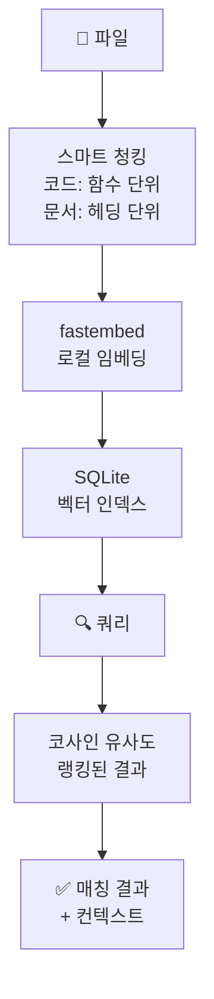

# embgrep

[](https://pypi.org/project/embgrep/)
[](https://pypi.org/project/embgrep/)
[](https://opensource.org/licenses/MIT)

> [English](README.md)

**로컬 시맨틱 검색 — 임베딩 기반 grep, 외부 서비스 불필요.**

코드베이스와 문서를 키워드가 아닌 *의미*로 검색합니다. embgrep은 파일을 로컬 임베딩으로 인덱싱하고 시맨틱 쿼리를 실행합니다 — API 키 불필요, 클라우드 서비스 불필요, 벡터 DB 서버 불필요.

## 기능

- **로컬 임베딩** — [fastembed](https://github.com/qdrant/fastembed) (ONNX Runtime) 사용, API 키 불필요
- **SQLite 저장** — 단일 파일 인덱스, 외부 벡터 DB 불필요
- **증분 인덱싱** — 변경된 파일만 재인덱싱 (SHA-256 해시 비교)
- **스마트 청킹** — 코드는 함수 단위, 문서는 헤딩 단위로 분할
- **MCP 네이티브** — LLM 에이전트 통합을 위한 4-도구 FastMCP 서버
- **15+ 파일 타입** — `.py`, `.js`, `.ts`, `.java`, `.go`, `.rs`, `.md`, `.txt`, `.yaml`, `.json`, `.toml` 등

## 설치

```bash
pip install embgrep              # 코어 (fastembed + numpy)
pip install embgrep[cli]         # + click/rich CLI
pip install embgrep[mcp]         # + FastMCP 서버
pip install embgrep[all]         # 전체
```

## 빠른 시작

### Python API

```python
from embgrep import EmbGrep

eg = EmbGrep()

# 디렉토리 인덱싱
eg.index("./my-project", patterns=["*.py", "*.md"])

# 시맨틱 검색
results = eg.search("database connection pooling", top_k=5)
for r in results:
    print(f"{r.file_path}:{r.line_start}-{r.line_end} (score: {r.score:.4f})")
    print(f"  {r.chunk_text[:80]}...")

# 증분 업데이트 (변경된 파일만)
eg.update()

# 인덱스 통계
status = eg.status()
print(f"{status.total_files} files, {status.total_chunks} chunks, {status.index_size_mb} MB")

eg.close()
```

### CLI

```bash
# 프로젝트 인덱싱
embgrep index ./my-project --patterns "*.py,*.md"

# 검색
embgrep search "error handling patterns"

# 파일 타입 필터
embgrep search "async database query" --path-filter "%.py"

# 상태 확인
embgrep status

# 변경 파일 업데이트
embgrep update
```

### MCP 서버

Claude Desktop / MCP 클라이언트 설정에 추가:

```json
{
  "mcpServers": {
    "embgrep": {
      "command": "embgrep-mcp"
    }
  }
}
```

### MCP 도구

| 도구 | 설명 |
|------|------|
| `index_directory` | 시맨틱 검색을 위해 디렉토리의 파일 인덱싱 |
| `semantic_search` | 자연어로 인덱싱된 파일 검색 |
| `index_status` | 현재 인덱스 통계 조회 |
| `update_index` | 증분 업데이트 — 변경된 파일만 재인덱싱 |

## 동작 원리



1. **청킹** — 파일을 의미 단위로 분할:
   - 코드 파일 (`.py`, `.js`, `.ts` 등): 함수/클래스 경계로 분할
   - 문서 (`.md`, `.txt`): 헤딩 또는 단락 구분으로 분할
   - 설정 파일: 고정 크기 청킹

2. **임베딩** — 각 청크를 [BGE-small-en-v1.5](https://huggingface.co/BAAI/bge-small-en-v1.5)로 384차원 벡터로 변환 (ONNX Runtime, PyTorch 불필요)

3. **저장** — 임베딩을 로컬 SQLite 데이터베이스에 BLOB으로 저장

4. **검색** — 쿼리 텍스트를 임베딩하고 코사인 유사도로 전체 청크와 비교

## 설정

| 파라미터 | 기본값 | 설명 |
|---------|--------|------|
| `db_path` | `~/.local/share/embgrep/embgrep.db` | SQLite 데이터베이스 위치 |
| `model` | `BAAI/bge-small-en-v1.5` | fastembed 모델명 |
| `max_chunk_size` | 1000 chars | 고정 크기 분할 시 최대 청크 크기 |
| `top_k` | 5 | 검색 결과 수 |

## QuartzUnit 생태계

| 패키지 | 설명 |
|--------|------|
| [markgrab](https://github.com/QuartzUnit/markgrab) | HTML/YouTube/PDF/DOCX → LLM-ready 마크다운 |
| [snapgrab](https://github.com/QuartzUnit/snapgrab) | URL → 스크린샷 + 메타데이터 |
| [docpick](https://github.com/QuartzUnit/docpick) | OCR + LLM 문서 구조화 추출 |
| [browsegrab](https://github.com/QuartzUnit/browsegrab) | 로컬 LLM 브라우저 에이전트 |
| [feedkit](https://github.com/QuartzUnit/feedkit) | RSS 피드 수집 + MCP |
| **embgrep** | **로컬 시맨틱 파일 검색** |

## 라이선스

MIT
